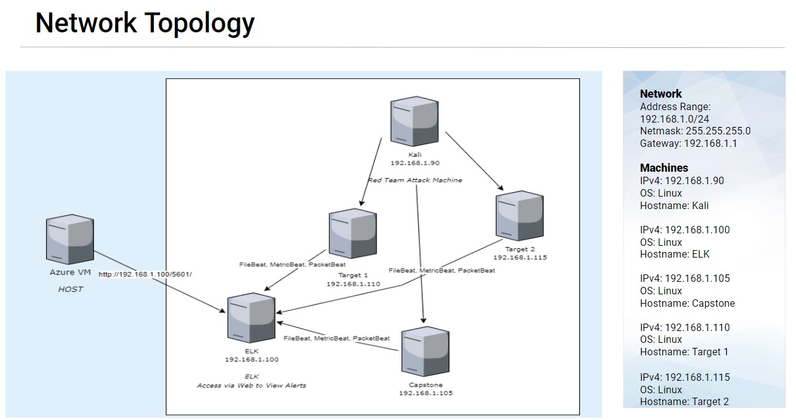
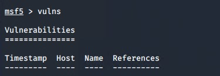
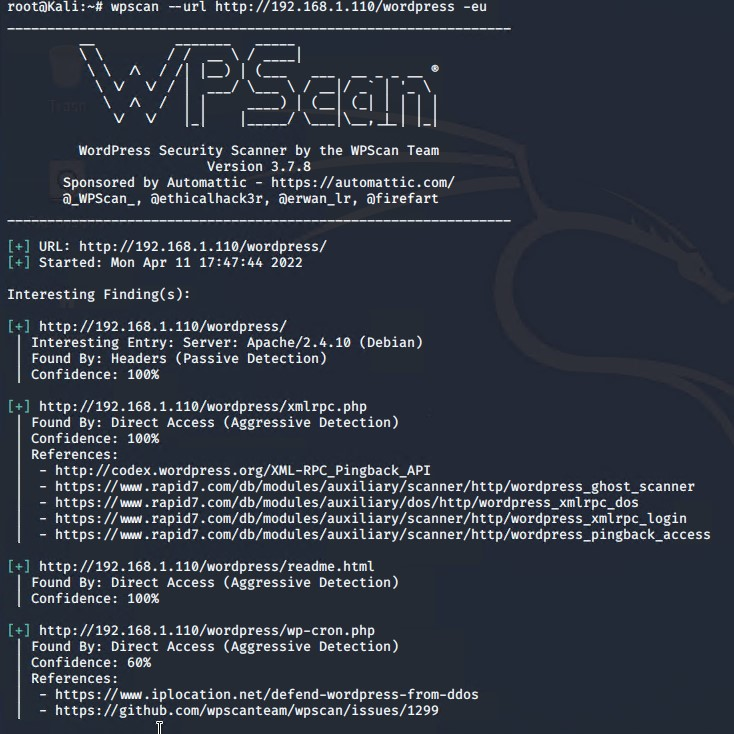
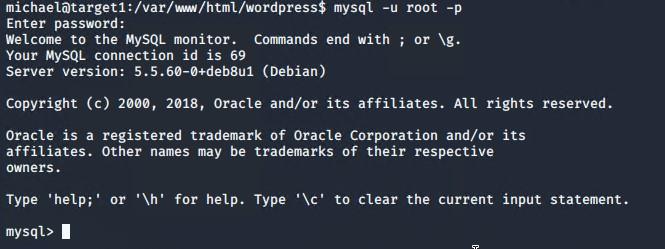

# pentest_example
This exercise demonstrates penetration testing and reporting.
This activity was part of a larger project, but highlights finding, gaining access to, and exploiting servers running Wordpress sites.


The following are the vulnerabilities that were exploited in this attack:
  - [Wordpress Enumeration CVE-2019-6579](https://nvd.nist.gov/vuln/detail/CVE-2019-6579) - using wpscan, nikto, and gobuster
  - Weak passwords - easy to guess/bruteforce
  - Unprotected and Unsalted Hashes - cracked using johntheripper
  - Root privileges on user 'steven' for Python
  - [Remote Code Execution Vulnerability in PHPMailer 5.2.16 CVE-2016-10033](https://nvd.nist.gov/vuln/detail/CVE-2016-10033)
  - [MySQL 5.x User Defined Functions (UDF) Vulnerability CVE-2005-2572](https://nvd.nist.gov/vuln/detail/CVE-2005-2572)
   

This document contains a step by step walkthrough of the attack process including the commands used, and screenshots of the command line.

### Description of the Topology

The exploit took place on the network depicted below.



The Kali machine was used to connect to each of the servers individually and through a variety of exploits gain root access to each server and capture flags.

### Target 1 Exploitation

The first step was finding out our network information.


Then using nmap to scan the machine and identifying what services were running. 
On the Kali machine, nmap was used to identify the machine and its services.


The scan revealed ports 22, 80, 111, 139, and 445 were open on Target 1 machine

Next using metasploit, we ran a services and vulnerabilites scan to determine if there was any other useful information:




This search yeilded nothing particularly valuable.
We then used 'wpscan' command to enumerate the server using the command
```
wpscan --url http://192.168.1.110/wordpress -eu
```



This gave us a more detailed look at the users who have access to the server. Because we had usernames, we were able to guess/brute force the password to use ssh to connect to the machine. We guessed user 'michael' was using password 'michael' which is a pretty silly thing to do, but a great example of a very weak password.
As a result, we were able to log into the server using ssh, since we had already established that port 22 was open on the machine.


Next, we looked for flags:


Afterwards, we decided to investigate what we could on the machine, and discovered a 'wp-config' file which had an unencrypted username and password for a myql database on the machine.


Using the credentials obtained, we opened the myql server using the command
```
mysql -u root -p
```
and entered the password 'R@v3nSecurity'



Exploring the mysql database, we were able to discover both the third flag, but exploring various directories, as well as find password hashes for both user 'steven' and 'michael' using the command
```
SELECT * FROM wp_users;
```


Next we copied the hash values into a text file called 'wp_hashes.txt', and the used johntheripper to decrypt the hash values using command:
```
john wp_hashes.txt
```


Finally, using user 'steven' password 'pink84' we used ssh to gain access to the server to gain root privilege. First identifying user priviliges, and the exploiting root access to python using the command
```
sudo python -c 'import pty;pty.spawn("/bin/bash");'
```


### Target 2 Exploitation
