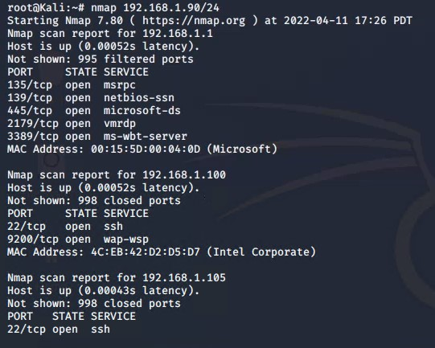

# pentest_example
This exercise demonstrates penetration testing and reporting.
This activity was part of a larger project, but highlights finding, gaining access to, and exploiting servers running Wordpress sites.


The following are the vulnerabilities that were exploited in this attack:
  - [Wordpress Enumeration CVE-2019-6579](https://nvd.nist.gov/vuln/detail/CVE-2019-6579) - using wpscan, nikto, and gobuster
  - Weak passwords - easy to guess/bruteforce
  - Unprotected and Unsalted Hashes - cracked using johntheripper
  - Root privileges on user 'steven' for Python
  - [Remote Code Execution Vulnerability in PHPMailer 5.2.16 CVE-2016-10033](https://nvd.nist.gov/vuln/detail/CVE-2016-10033)
  - [MySQL 5.x User Defined Functions (UDF) Vulnerability CVE-2005-2572](https://nvd.nist.gov/vuln/detail/CVE-2005-2572)
   

This document contains a step by step walkthrough of the attack process including the commands used, and screenshots of the command line.

### Description of the Topology

The exploit took place on the network depicted below.


The Kali machine was used to connect to each of the servers individually and through a variety of exploits gain root access to each server and capture flags.

### Target 1 Exploitation

The first step was finding out our network information.


Then using nmap to scan the machine and identifying what services were running. 
On the Kali machine, nmap was used to identify the machine and its services.




The scan revealed ports 22, 80, 111, 139, and 445 were open on Target 1 machine

Next using metasploit, we ran a services and vulnerabilites scan to determine if there was any other useful information:


This search yeilded nothing particularly valuable.
We then used 'wpscan' command to enumerate the server using the command
```
wpscan --url http://192.168.1.110/wordpress -eu
```


This gave us a more detailed look at the users who have access to the server. Because we had usernames, we were able to guess/brute force the password to use ssh to connect to the machine. We guessed user 'michael' was using password 'michael' which is a pretty silly thing to do, but a great example of a very weak password.
As a result, we were able to log into the server using ssh, since we had already established that port 22 was open on the machine.


Next, we looked for flags:


Afterwards, we decided to investigate what we could on the machine, and discovered a 'wp-config' file which had an unencrypted username and password for a myql database on the machine.


Using the credentials obtained, we opened the myql server using the command
```
mysql -u root -p
```
and entered the password 'R@v3nSecurity'


The playbook implements the following tasks:
- In 3-5 bullets, explain the steps of the ELK installation play. E.g., install Docker; download image; etc._
- install docker
- install python
- increase the virtual memory
- download and launch docker elk container
  and expose ports 5601, 9200, and 5044
  enter them in the playbook as 
  ```
     5601:5601
     9200:9200
     5044:5044
     ```

The following screenshot displays the result of running `docker ps` after successfully configuring the ELK instance.


### Target Machines & Beats
This ELK server is configured to monitor the following machines:
Web-1 10.0.0.7 
Web-2 10.0.0.8 
Web-3 10.0.0.12

We have installed the following Beats on these machines:
ElkVM, Web-1, Web-2, and Web-3
Beats installed were MetricBeat and FileBeat

These Beats allow us to collect the following information from each machine:

Filebeat collects ans ships log events: ex. system.syslog are system logs
Metricbeat collects and ships host metrics and statistics: ex. CPU usage, memory usage, inbound and outbound traffic measurements.

### Using the Playbook
In order to use the playbook, you will need to have an Ansible control node already configured. Assuming you have such a control node provisioned: 

To set up ELK server
SSH into the control node and follow the steps below:
- Copy the install-elk.yml file to /etc/ansible directory.
- Update the hosts file to include the ip addresses of the server that will be configured. 
- Run the playbook using ansible-playbook intall-elk.yml, and navigate to http:[ipaddressofelkvm]:5601/app/kibana to check that the installation worked as expected.
- To install the playbook, from the /etc/ansible directory run the command ```ansible-playbook install-elk.yml```

To set up Filebeat
SSH into control node and follow the steps below:
- Copy the filebeat-config.yml into /etc/ansible/files
- Update filebeat-playbook.yml (in /etc/ansible/roles directory) to include installer using the following command: 
- ```curl -L -O https://artifacts.elastic.co/downloads/beats/filebeat/filebeat-7.6.1-amd64.deb```
- Update the filebeat-config.yml file to add the ip address of the ElkVM machine where the following lines appear:

```
output.elasticsearch:
  #Array of hosts to connect to.
 hosts: ["10.1.0.4:9200"]
  username: "elastic"
  password: "changeme” 
 

 setup.kibana:
  host: "10.1.0.4:5601"
```
Once your Filebeat is running, you will be able to access the data through Kibana. It should appear like the following:


To set up Metricbeat
SSH into control node and follow the steps below:
- Copy the metricbeat-config.yml into /etc/ansible/files
- Update metricbeat-playbook.yml (in /etc/ansible/roles directory) to include installer using the following command: curl -L -O https://artifacts.elastic.co/downloads/beats/metricbeat/metricbeat-7.6.1-amd64.deb
- Update the metricbeat-config.yml file to add the ip address of the ElkVM machine where the following lines appear:

```
output.elasticsearch:
  #Array of hosts to connect to.
 hosts: ["10.1.0.4:9200"]
  username: "elastic"
  password: "changeme” 


 setup.kibana:
  host: "10.1.0.4:5601"
```
Once your Metricbeat is running, you will be able to look at the perfomance metrics within Kibana. It should appear like the following:

